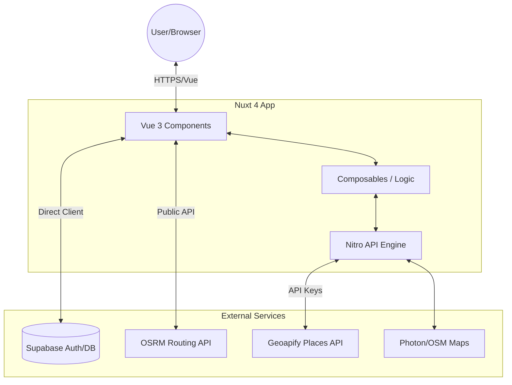

# System Architecture

TripWiser is built on a modern, event-driven, and API-centric architecture using Nuxt 4. This document outlines the core components and how they interact.

## 🏗️ High-Level Perspective

The application follows a **BFF (Backend-for-Frontend)** pattern where the Nuxt Nitro server acts as a secure gateway to various external services.

## 🧩 Core Components

### 1. Frontend Layer (Vue 3 / Nuxt)
- **Pages**: Structured routing using Nuxt's file-based system.
- **Components**: Atomic and modular UI elements (MapViewer, TripDetailsModal).
- **Glassmorphism UI**: Custom CSS/Tailwind system for a premium feel.

### 2. Server Engine (Nitro)
- **Places Proxy**: Standardizes results from different geocoding providers (Geoapify/Photon).
- **Itinerary Generator**: Complex logic that processes budget, travel style, and duration to produce a balanced schedule.

### 3. Data & Auth (Supabase)
- **PostgreSQL**: Stores user-saved trips and preferences (See [Database Schema](./DATABASE_SCHEMA.md)).
- **GoTrue**: Handles JWT-based authentication.

### 4. Special Engines
- **Leaflet**: Client-side rendering of geographic data.
- **OSRM**: Fetching actual road-based geometries for maps.
