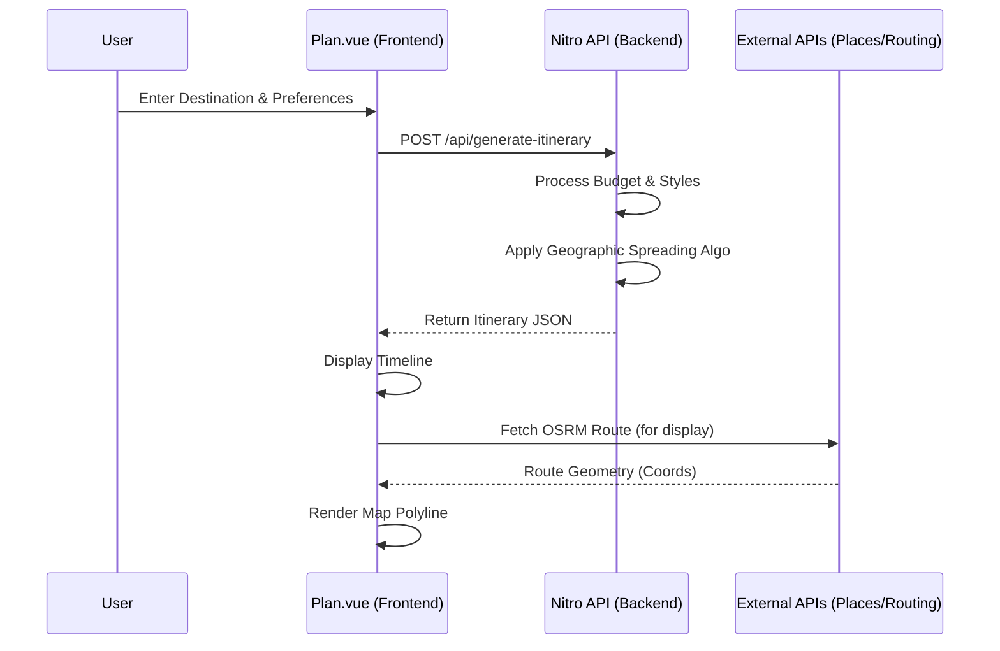

# Data Flow: Itinerary Generation

Understanding how a user input becomes a mapped itinerary.

## 🔄 The Generation Lifecycle

## 🛠️ Key Logic: Geographic Spreading
To avoid map clustering:
1. The generator receives activity coordinates.
2. An **Offset Algorithm** applies small random variances to markers if they are too close.
3. The **Leg Duration logic** calculates the time between `Activity(n)` and `Activity(n+1)` based on the selected transport mode.
