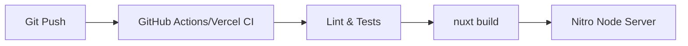

# Infrastructure & Deployment

This document describes the environment and infrastructure requirements for running and deploying TripWiser.

## 🛰️ Infrastructure Components

### 1. Application Hosting
- **Type**: Node.js Server or Edge Functions.
- **Recommended Platform**: Vercel, Netlify, or a VPS (contenerization via Docker).
- **Engine**: [Nitro](https://nitro.unjs.io/), which allows the app to be deployed on almost any provider (AWS, Azure, Cloudflare Workers, etc.).

### 2. Database & Persistence
- **Provider**: [Supabase](https://supabase.com/)
- **Features Used**:
  - **Auth**: Email/Password authentication.
  - **Database**: PostgreSQL for storing trip JSON objects.
  - **Edge Functions**: (Optional) For heavier background tasks.

### 3. API Dependencies
TripWiser relies on distributed APIs for its core functionality:
- **Routing**: [Project OSRM](http://project-osrm.org/) (Public instances).
- **Geocoding**: 
  - [Geoapify](https://www.geoapify.com/) (API Key required).
  - [Photon/OSM](https://photon.komoot.io/) (No key, fallback).

## 🛡️ Security

- **Environment Variables**: All sensitive keys (Supabase Secret, Geoapify Key) are handled via `runtimeConfig` and kept server-side in Nitro.
- **CORS**: Configured in `nuxt.config.ts` to prevent unauthorized domain access.
- **Database Policies (RLS)**: Row Level Security is enforced in Supabase to ensure users can only access their own itineraries.

## 📦 Build Pipeline

